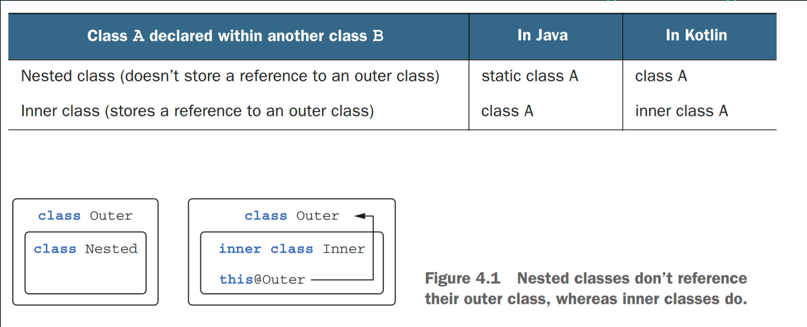

# Kotlin

> “Kotlin is a pragmatic programming language for the JVM and
> Android that combines OO and functional features and is
> focused on interoperability, safety, clarity, and tooling support.”

Andrey Breslav, 2016

> "One of the most important use cases for Kotlin is a big
> Java codebase whose developers want a better language:
> you can mix Java and Kotlin freely and migration can be
> gradual and doesn't have to alter entire codebase.”

Andrey Breslav, 2014

## Index

### Introduction

- [References](#references)
- [Variables](#variables)
- [Functions](#functions)
- [Control structures](#control-structures)
- [Packages](#packages)
- [Exceptions](#exceptions)
- [Types](#types)
- [Collections](#collections)
- [Classes](#classes)

### Advanced concepts

- [Secondary constructors](#secondary-constructors)
- [Object keyword](#object-keyword)
- [Inner functions](#inner-functions)
- [Extension functions](#extension-functions)
- [Infix functions](#infix-functions)
- [Data classes](#data-classes)
- [Nested and inner classes](#nested-and-inner-classes)
- [Sealed classes](#sealed-classes)
- [Operator overloading](#operator-overloading)
- [Delegation](#delegation)
- [Coroutines](#coroutines)
- [Scope functions](#scope-functions)

## References

- [Getting started](https://kotlinlang.org/docs/getting-started.html)
- [Kotlin in action](https://www.manning.com/books/kotlin-in-action)

## Variables

In Kotlin, everything is an object in the sense that you can call member functions and properties on
any variable.

While certain types have an optimized internal representation as primitive values at
runtime (such as numbers, characters, booleans and others), they appear and behave like regular
classes to you.

Variables can be declared using `var` and `val` keywords. `var` is mutable and `val` is immutable.

```kotlin
var a: Int = 1
val b = 2
val c: Int
c = 3
```

Variables can be declared at package level.
Then, they belong to the default package and can be accessed from any other package.

## Functions

As variables, functions can be declared at package level.

Functions can have default values for parameters.

```kotlin
fun sum(a: Int = 0, b: Int = 0): Int {
  return a + b
}
```

Functions can have named parameters.

```kotlin
fun sum(a: Int = 0, b: Int = 0): Int {
  return a + b
}

fun main(args: Array<String>) {
  println(sum(a = 1, b = 2))
}
```

We can interpolate variables in strings and use expressions in string templates.

```kotlin
fun main(args: Array<String>) {
  val a = 1
  val s1 = "a is $a"
  a = 2
  val s2 = "${s1.replace("is", "was")}, but now is $a"
  println(s2)
}
```

NOTE: In Java this is in preview mode. https://openjdk.java.net/jeps/8273943

By default, functions return `Unit` (void). We can omit the return type.

```kotlin
fun printSum(a: Int, b: Int) {
  println("sum of $a and $b is ${a + b}")
}
```

Functions can be declared inside other functions.

```kotlin
fun main(args: Array<String>) {
  fun sum(a: Int, b: Int): Int {
    return a + b
  }

  println(sum(1, 2))
}
```

Functions can be declared as block body or expression body.

```kotlin
fun sum(a: Int, b: Int): Int {
  return a + b
}

fun sum(a: Int, b: Int) = a + b
```

## Control structures

In Kotlin, most of the control structures are expressions.
It means that they return a value.

```kotlin
fun max(a: Int, b: Int) = if (a > b) a else b
```

When a function returns nothing, it returns `Unit`.

In Kotlin, `when` replaces `switch` in Java.

```kotlin
fun describe(obj: Any): String =
  when (obj) {
    1 -> "One"
    "Hello" -> "Greeting"
    is Long -> "Long"
    !is String -> "Not a string"
    else -> "Unknown"
  }
```

We can use objects in `when` statements, not only expressions.

```kotlin
fun main(args: Array<String>) {
  val x = 1
  val y = 2
  when (setOf(x, y)) {
    setOf(0, 1) -> println("x or y is 0 or 1")
    setOf(1, 2) -> println("x or y is 1 or 2")
    else -> println("x or y is not 0 or 1")
  }
}
```

We can use the for loop to iterate over anything that provides an iterator.

```kotlin
fun main(args: Array<String>) {
  val items = listOf("apple", "banana", "kiwifruit")
  for (item in items) {
    println(item)
  }
}
```

We can use ranges to iterate over numbers.

```kotlin
fun main(args: Array<String>) {
  for (x in 1..5) {
    println(x)
  }
}
```

## Packages

By default, Kotlin imports `kotlin.*`, `kotlin.annotation.*` and `kotlin.collections.*` packages.

If you don't specify a package, your code goes into the default package.

You can alias imports with `as` keyword.

```kotlin
import java.util.Random as Rnd
```

## Exceptions

Kotlin doesn't have checked exceptions.

“Examination of small programs leads to the conclusion that
requiring exception specifications could both enhance
developer productivity and enhance code quality, but
experience with large software projects suggests a different
result – decreased productivity and little or no increase in code
quality.”

Bruce Eckel, Thinking in Java

```kotlin
fun main(args: Array<String>) {
  val percentage =
    if (args.size > 0) args[0].toInt() else
      throw IllegalArgumentException("Percentage expected")
  println(percentage)
}
```

Try is an expression. I.e. it returns a value.

```kotlin
fun main(args: Array<String>) {
  val s = args[0]
  val number = try {
    Integer.parseInt(s)
  } catch (e: NumberFormatException) {
    null
  }
  println(number)
}
```

## Types

There aren't primitive types in Kotlin. Everything is an object.

```kotlin
fun main(args: Array<String>) {
  val i: Int = 1
  val l: Long = 1
  val f: Float = 1.0f
  val d: Double = 1.0
  val b: Byte = 1
  val s: Short = 1
  val c: Char = 'a'
  val bool: Boolean = true
}
```

There is no implicit conversion between types. You must use explicit conversion.

```kotlin
fun main(args: Array<String>) {
  val i: Int = 1
  val l: Long = i.toLong()
}
```

### Any

The type 'Any' is the root of the Kotlin class hierarchy. Every Kotlin class has 'Any' as a
superclass.

It's like 'Object' in Java.

The main difference is that 'Any' includes primitive types.

All classes in Kotlin have 'equals', 'hashCode' and 'toString' methods due to being subclasses of
'Any'.

```kotlin
fun main(args: Array<String>) {
  val any: Any = 1
  println(any)
}
```

### Unit

The type 'Unit' is the equivalent to 'void' in Java.

It is returned implicitly by functions that don't return anything.

The main difference with 'void' is that 'Unit' is a real class.
So, it can be used as a type parameter or be used as a return type.

```kotlin
fun main(args: Array<String>) {
  val unit: Unit = println("Hello")
}
```

### Nothing

The type 'Nothing' is a subtype of all types.

It is used to indicate that a function never returns.

It could be handy to use it for testing frameworks, code analysis tools, etc.

```kotlin
fun fail(message: String): Nothing {
  throw IllegalArgumentException(message)
}

fun main(args: Array<String>) {
  // The compiler is going to say that this is unreachable code.
  val i = fail("Error")
}
```

In Kotlin, the 'is' operator is used to check if an object is an instance of a type.

```kotlin
fun length(obj: Any): Int? {
  if (obj is String) {
    return obj.length
  }
  return null
}

fun len(x: Any) {
  if (x !is String) return
  println(x.length)
}
```

### Nullability


In Java, there are several ways to deal with nullability.

- You can check for null.
- You can use the Optional class.
- You can use annotations like @Nullable and @NotNull.
- You can use IDE inspections.
- You can use static analysis tools.
- Etc.

In modern languages, the tendency is to use the type system to deal with nullability.
So the problem is solved at compile time not at runtime.

In Kotlin, the type system distinguishes between references that can hold null (nullable references)
and those that can not (non-null references).

The '?' symbol is used to mark a type as nullable.

```kotlin
fun main(args: Array<String>) {
  val s1: String = "abc"
  val s2: String? = null
}
```

You can use the '?.', '?:' (Elvis operator) and '!!' operators to deal with nullability.

The '!!' operator returns a type as non-null or throws an exception if the value is null (NPE).

```kotlin
fun main(args: Array<String>) {
  val s1: String? = "abc"
  val s2: String? = null
  println(s1?.length)
  println(s2?.length)
  println(s1?.length ?: 0)
  println(s1!!.length)
}
```

## Collections

There are lists, sets and maps.

```kotlin
fun main(args: Array<String>) {
  val list = listOf(1, 2, 3)
  val set = setOf(1, 2, 3)
  val map = mapOf(1 to "one", 2 to "two", 3 to "three")
}
```

Kotlin has immutable and mutable collections.

The default collections are immutable.

```kotlin
fun main(args: Array<String>) {
  val list = listOf(1, 2, 3)
  val set = setOf(1, 2, 3)
  val map = mapOf(1 to "one", 2 to "two", 3 to "three")
}
```

You can use the 'to' infix function to create pairs.

A pair is a data class that holds two values, like a Tuple in other languages.

```kotlin
fun main(args: Array<String>) {
  val pair = 1 to "one"
}
```

In collections there are two nullability options.

- The collection can be nullable.
- The elements of the collection can be nullable.

```kotlin
fun main(args: Array<String>) {
  val list: List<Int>? = null
  val list2: List<Int?> = listOf(1, 2, null)
}
```

The correspondence with Java collections is the following:


## Classes

You can use custom getters and setters.

```kotlin
class Person(val name: String, val age: Int) {
  val isAdult get() = age = 18
}

fun main() {
  val person = Person("Raul", 40)
  println(person.isAdult)
}

class Person(val name: String, val age: Int) {
  var age = age
    set(value) {
      if (value = 0) field = age
    }
}

fun main() {
  val person = Person("Raul", 40)
  person.age = -1
  println(person.age)
}
```

In Kotlin, classes are final by default.

```kotlin
class Person
```

To make a class inheritable, you must use the 'open' keyword.

```kotlin
open class Person
```

Interfaces in Kotlin can contain declarations of abstract methods, as well as method
implementations.

```kotlin
interface Person {
  fun name(): String
  fun age(): Int {
    return 0
  }
}
```

The difference between abstract classes and interfaces is that abstract classes can have state.

Also, a class can only inherit from one abstract class but can implement multiple interfaces.

## Secondary constructors

Classes in Kotlin can have one primary constructor and one or more secondary constructors.

The primary constructor is part of the class header and can't have any code.
You can use the 'init' block to put code in the primary constructor.

```kotlin
class Person(val name: String, val age: Int) {
  init {
    println("Person created with name $name and age $age")
  }
}
```

Secondary constructors are prefixed with the 'constructor' keyword.
They must delegate to the primary constructor.

```kotlin
class Person(val name: String, val age: Int) {
  constructor(name: String) : this(name, 0)
}
```

## Object keyword

With the 'object' keyword, you can create at the same time a class and an instance of that class.

1. Object declarations (singletons)

    - Thread-safe by default.

    - Can have properties, methods, etc.

    - Can not have constructors.

    - It is initialized lazily (when accessed for the first time).

   ```kotlin
    object Singleton {
       fun foo() = "foo"
     }
        
     fun main() {
       println(Singleton.foo())
     }
   ```

2. Companion objects (static factory methods)

    - Kotlin doesn't have static methods.
    - Functions and variables at level package substitute static methods and variables.
    - Functions and variables at level package can not access private members of a class.

    ```kotlin
    class Person(val name: String) {
      companion object {
        fun create(name: String) = Person(name)
      }
    }
    
    fun main() {
      val person = Person.create("Raul")
      println(person.name)
    }
    ```

3. Object expressions (anonymous inner classes)

    - Used as a replacement for anonymous inner classes in Java.
    - Normally, they are used as function parameters.
    - Can implement multiple interfaces.
    - Can not have constructors.
    - They aren't singletons.

    ```kotlin
      interface Person {
        fun name(): String
      }
    
      fun main() {
        val person = object : Person {
          override fun name() = "Raul"
        }
        println(person.name())
      }
    ```

### Initialization

1. Object declarations are initialized lazily (when accessed for the first time).
2. Object companions are initialized when the class is loaded.
3. Object expressions are initialized immediately, where they are used.

## Inner functions

In Kotlin, you can declare functions inside other functions.

It is useful to encapsulate logic and avoid polluting the namespace.

```kotlin
fun main() {
  fun foo() = "foo"
  println(foo())
}
```

## Extension functions

Extension functions allow you to add new functionality to existing classes.

```kotlin
fun String.lastChar(): Char = this.get(this.length - 1)

fun main() {
  println("abc".lastChar())
}
```

Could be useful to add new functionality to classes that you can't modify.

```kotlin
class User(val id: Int, val name: String, val address: String)

fun User.validate() {
  fun validateAttribute(attribute: String, value: String) {
    if (value.isEmpty()) {
      throw IllegalArgumentException("Can't save user $id: empty $attribute")
    }
  }
  validateAttribute("Name", name)
  validateAttribute("Address", address)
}

fun saveUser(user: User) {
  user.validate()
  println("User saved.")
}

fun main() {
  val user = User(1, "Raul", "Madrid")
  saveUser(user)
}
```

## Infix functions

Infix functions are functions that can be called without using the dot and the parentheses.

```kotlin
infix fun Int.plus(x: Int) = this + x

fun main() {
  println(1 plus 2)
}
```

## Data classes

Data classes are classes that are designed to hold data.
They are basically sysntactic sugar to create POJOs.

They have: equals, hashCode, toString, copy, destructuring, etc.

```kotlin
data class Person(val name: String, val age: Int)

fun main() {
  val person = Person("Raul", 40)
  println(person)
}
```

## Nested and inner classes

A nested class is a class that is defined inside another class.

It doesn't have access to the outer class instance.

```kotlin
class Outer {
  class Nested {
    fun foo() = "foo"
  }
}

fun main() {
  val nested = Outer.Nested().foo()
}
```

An inner class is a nested class that is marked with the 'inner' keyword.

It has access to the outer class instance.

```kotlin
class Outer {
  private val bar: Int = 1

  inner class Inner {
    fun foo() = bar
  }
}

fun main() {
  val inner = Outer().Inner().foo()
}
```



## Sealed classes

Sealed classes are used to represent restricted class hierarchies.

They are useful when you want to restrict the type hierarchy.

```kotlin
sealed class Expr
data class Const(val number: Double) : Expr()
data class Sum(val e1: Expr, val e2: Expr) : Expr()
object NotANumber : Expr()

fun eval(expr: Expr): Double = when (expr) {
  is Const -> expr.number
  is Sum -> eval(expr.e1) + eval(expr.e2)
  NotANumber -> Double.NaN
}
```

## Operator overloading

Java doesn't allow operator overloading.

Kotlin allows you to overload operators.

They are custom implementation of Kotlin operators.
It similar to Javascript operator overloading.

You can not overload '===' and '!==' operators.

```kotlin
data class Point(val x: Int, val y: Int) {
  operator fun plus(other: Point) = Point(x + other.x, y + other.y)
}

fun main() {
  val p1 = Point(1, 2)
  val p2 = Point(3, 4)
  println(p1 + p2)
}
```

## Delegation

Delegation is a mechanism by which an object can delegate one or more of its functions to other

It is similar to inheritance, but it is more flexible.

```kotlin
interface Base {
  fun foo()
}

class BaseImpl(val x: Int) : Base {
  override fun foo() {
    println(x)
  }
}

class Derived(b: Base) : Base by b

fun main() {
  val b = BaseImpl(10)
  Derived(b).foo()
}
```

## Coroutines

Coroutines are a Kotlin feature that converts async callbacks into sequential code.

It's a function that can be suspended and resumed later.

They are similar to Javascript promises or Java threads.

The library that implements coroutines is called kotlinx.coroutines.

```kotlin
fun main() = runBlocking {
  val job = launch {
    delay(1000L)
    println("World!")
  }
  println("Hello,")
  job.join()
}
```

## Scope functions

Scope functions are functions that execute a block of code within the context of an object.
They provide a temporary scope where you can access the object without its name.
There are five scope functions: let, run, with, apply and also.

The basic functionality of all of them is the same, to execute a block of code within the
context of an object.
They made the code more concise and readable.

Inside the block, the object is referenced by 'this' or 'it'.
'this' is the lambda receiver and 'it' is the lambda argument.

### let

```kotlin
inline fun <T, R> T.let(block: (T) -> R): R
```

Calls the specified function block with this value as its argument and returns its result.

Uses:

- Executing a lambda on non-nullable objects
- Introducing an expression as a variable in local scope: let

```kotlin
fun main() {
  val person: Person? = Person("Raul", 40)
  val name = person?.let {
    println(it.name)
    it.name
  }
  println(name)
}
```

### with

```kotlin
inline fun <T, R> with(receiver: T, block: T.() -> R): R
```

Uses:

- Grouping function calls on an object

```kotlin
fun getSomeObject(): Something {
  val someObject = Something()
  with(someObject) {
    println("Value $value")
    println("type $type")
  }
  return someObject
}
```

### run

```kotlin
inline fun <R> run(block: () -> R): R

inline fun <T, R> T.run(block: T.() -> R): R
```

Calls the specified function block and returns its result.
Calls the specified function block with this value as its receiver and returns its result.

Uses:

- Calculating a return value based on multiple properties of an object
- Running statements where an expression is required

```kotlin
fun getSomeObject(): String {
  val someObject = Something()
  val result = someObject.run {
    value = "Some Value"
    type = 1
    "$value of type $type "
  }
  return result
}
```

### apply

```kotlin
inline fun <T> T.apply(block: T.() -> Unit): T
```

Calls the specified function block with this value as its receiver and returns this value.

Uses:

- Object configuration

```kotlin
fun getSomeObject(): Something {
  val someObject = Something()
  someObject.apply {
    value = "Some Value"
    type = 1
  }
  return someObject
}
```

### also

```kotlin
inline fun <T> T.also(block: (T) -> Unit): T
```

Calls the specified function block with this value as its argument and returns this value.

Uses:

- Additional actions on an object, logging, etc.

```kotlin
fun getSomeObject(): Something {
  val someObject = Something()
  someObject.also {
    println("Value ${it.value}")
    println("type ${it.type}")
  }
  return someObject
}
```
