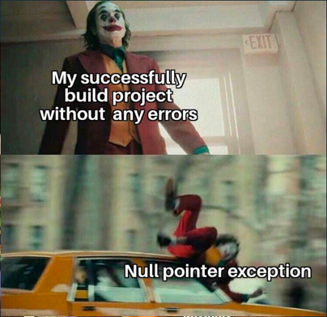
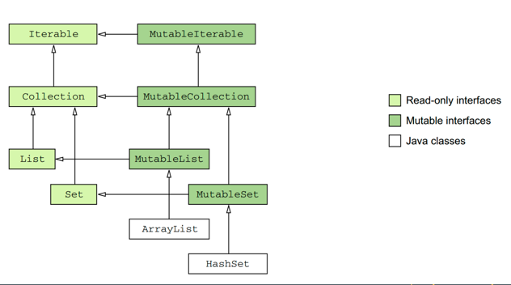

# Kotlin

> “Kotlin is a pragmatic programming language for the JVM and
> Android that combines OO and functional features and is
> focused on interoperability, safety, clarity, and tooling support.”

Andrey Breslav, 2016

> "One of the most important use cases for Kotlin is a big
> Java codebase whose developers want a better language:
> you can mix Java and Kotlin freely and migration can be
> gradual and doesn't have to alter entire codebase.”

Andrey Breslav, 2014

## Index

- [References](#references)
- [Variables](#variables)
- [Functions](#functions)
- [Control structures](#control-structures)
- [Packages](#packages)
- [Exceptions](#exceptions)
- [Types](#types)
- [Collections](#collections)

## References

- [Getting started](https://kotlinlang.org/docs/getting-started.html)
- [Kotlin in action](https://www.manning.com/books/kotlin-in-action)

## Variables

In Kotlin, everything is an object in the sense that you can call member functions and properties on
any variable.

While certain types have an optimized internal representation as primitive values at
runtime (such as numbers, characters, booleans and others), they appear and behave like regular
classes to you.

Variables can be declared using `var` and `val` keywords. `var` is mutable and `val` is immutable.

```kotlin
var a: Int = 1
val b = 2
val c: Int
c = 3
```

Variables can be declared at package level.
Then, they belong to the default package and can be accessed from any other package.

## Functions

As variables, functions can be declared at package level.

Functions can have default values for parameters.

```kotlin
fun sum(a: Int = 0, b: Int = 0): Int {
  return a + b
}
```

Functions can have named parameters.

```kotlin
fun sum(a: Int = 0, b: Int = 0): Int {
  return a + b
}

fun main(args: Array<String>) {
  println(sum(a = 1, b = 2))
}
```

We can interpolate variables in strings and use expressions in string templates.

```kotlin
fun main(args: Array<String>) {
  val a = 1
  val s1 = "a is $a"
  a = 2
  val s2 = "${s1.replace("is", "was")}, but now is $a"
  println(s2)
}
```

NOTE: In Java this is in preview mode. https://openjdk.java.net/jeps/8273943

By default, functions return `Unit` (void). We can omit the return type.

```kotlin
fun printSum(a: Int, b: Int) {
  println("sum of $a and $b is ${a + b}")
}
```

Functions can be declared inside other functions.

```kotlin
fun main(args: Array<String>) {
  fun sum(a: Int, b: Int): Int {
    return a + b
  }

  println(sum(1, 2))
}
```

Functions can be declared as block body or expression body.

```kotlin
fun sum(a: Int, b: Int): Int {
  return a + b
}

fun sum(a: Int, b: Int) = a + b
```

## Control structures

In Kotlin, most of the control structures are expressions.
It means that they return a value.

```kotlin
fun max(a: Int, b: Int) = if (a > b) a else b
```

When a function returns nothing, it returns `Unit`.

In Kotlin, `when` replaces `switch` in Java.

```kotlin
fun describe(obj: Any): String =
  when (obj) {
    1 -> "One"
    "Hello" -> "Greeting"
    is Long -> "Long"
    !is String -> "Not a string"
    else -> "Unknown"
  }
```

We can use objects in `when` statements, not only expressions.

```kotlin
fun main(args: Array<String>) {
  val x = 1
  val y = 2
  when (setOf(x, y)) {
    setOf(0, 1) -> println("x or y is 0 or 1")
    setOf(1, 2) -> println("x or y is 1 or 2")
    else -> println("x or y is not 0 or 1")
  }
}
```

We can use the for loop to iterate over anything that provides an iterator.

```kotlin
fun main(args: Array<String>) {
  val items = listOf("apple", "banana", "kiwifruit")
  for (item in items) {
    println(item)
  }
}
```

We can use ranges to iterate over numbers.

```kotlin
fun main(args: Array<String>) {
  for (x in 1..5) {
    println(x)
  }
}
```

## Packages

By default, Kotlin imports `kotlin.*`, `kotlin.annotation.*` and `kotlin.collections.*` packages.

If you don't specify a package, your code goes into the default package.

You can alias imports with `as` keyword.

```kotlin
import java.util.Random as Rnd
```

## Exceptions

Kotlin doesn't have checked exceptions.

“Examination of small programs leads to the conclusion that
requiring exception specifications could both enhance
developer productivity and enhance code quality, but
experience with large software projects suggests a different
result – decreased productivity and little or no increase in code
quality.”

Bruce Eckel, Thinking in Java

```kotlin
fun main(args: Array<String>) {
  val percentage =
    if (args.size > 0) args[0].toInt() else
      throw IllegalArgumentException("Percentage expected")
  println(percentage)
}
```

Try is an expression. I.e. it returns a value.

```kotlin
fun main(args: Array<String>) {
  val s = args[0]
  val number = try {
    Integer.parseInt(s)
  } catch (e: NumberFormatException) {
    null
  }
  println(number)
}
```

## Types

There aren't primitive types in Kotlin. Everything is an object.

```kotlin
fun main(args: Array<String>) {
  val i: Int = 1
  val l: Long = 1
  val f: Float = 1.0f
  val d: Double = 1.0
  val b: Byte = 1
  val s: Short = 1
  val c: Char = 'a'
  val bool: Boolean = true
}
```

There is no implicit conversion between types. You must use explicit conversion.

```kotlin
fun main(args: Array<String>) {
  val i: Int = 1
  val l: Long = i.toLong()
}
```

### Any

The type 'Any' is the root of the Kotlin class hierarchy. Every Kotlin class has 'Any' as a
superclass.

It's like 'Object' in Java.

The main difference is that 'Any' includes primitive types.

All classes in Kotlin have 'equals', 'hashCode' and 'toString' methods due to being subclasses of
'Any'.

```kotlin
fun main(args: Array<String>) {
  val any: Any = 1
  println(any)
}
```

### Unit

The type 'Unit' is the equivalent to 'void' in Java.

It is returned implicitly by functions that don't return anything.

The main difference with 'void' is that 'Unit' is a real class.
So, it can be used as a type parameter or be used as a return type.

```kotlin
fun main(args: Array<String>) {
  val unit: Unit = println("Hello")
}
```

### Nothing

The type 'Nothing' is a subtype of all types.

It is used to indicate that a function never returns.

It could be handy to use it for testing frameworks, code analysis tools, etc.

```kotlin
fun fail(message: String): Nothing {
  throw IllegalArgumentException(message)
}

fun main(args: Array<String>) {
  // The compiler is going to say that this is unreachable code.
  val i = fail("Error")
}
```

In Kotlin, the 'is' operator is used to check if an object is an instance of a type.

```kotlin
fun length(obj: Any): Int? {
  if (obj is String) {
    return obj.length
  }
  return null
}

fun len(x: Any) {
  if (x !is String) return
  println(x.length)
}
```

### Nullability



In Java, there are several ways to deal with nullability.

- You can check for null.
- You can use the Optional class.
- You can use annotations like @Nullable and @NotNull.
- You can use IDE inspections.
- You can use static analysis tools.
- Etc.

In modern languages, the tendency is to use the type system to deal with nullability.
So the problem is solved at compile time not at runtime.

In Kotlin, the type system distinguishes between references that can hold null (nullable references)
and those that can not (non-null references).

The '?' symbol is used to mark a type as nullable.

```kotlin
fun main(args: Array<String>) {
  val s1: String = "abc"
  val s2: String? = null
}
```

You can use the '?.', '?:' (Elvis operator) and '!!' operators to deal with nullability.

The '!!' operator returns a type as non-null or throws an exception if the value is null (NPE).

```kotlin
fun main(args: Array<String>) {
  val s1: String? = "abc"
  val s2: String? = null
  println(s1?.length)
  println(s2?.length)
  println(s1?.length ?: 0)
  println(s1!!.length)
}
```

## Collections

There are lists, sets and maps.

```kotlin
fun main(args: Array<String>) {
  val list = listOf(1, 2, 3)
  val set = setOf(1, 2, 3)
  val map = mapOf(1 to "one", 2 to "two", 3 to "three")
}
```

Kotlin has immutable and mutable collections.

The default collections are immutable.

```kotlin
fun main(args: Array<String>) {
  val list = listOf(1, 2, 3)
  val set = setOf(1, 2, 3)
  val map = mapOf(1 to "one", 2 to "two", 3 to "three")
}
```

You can use the 'to' infix function to create pairs.

A pair is a data class that holds two values, like a Tuple in other languages.

```kotlin
fun main(args: Array<String>) {
  val pair = 1 to "one"
}
```

In collections there are two nullability options.

- The collection can be nullable.
- The elements of the collection can be nullable.

```kotlin
fun main(args: Array<String>) {
  val list: List<Int>? = null
  val list2: List<Int?> = listOf(1, 2, null)
}
```

The correspondence with Java collections is the following:


